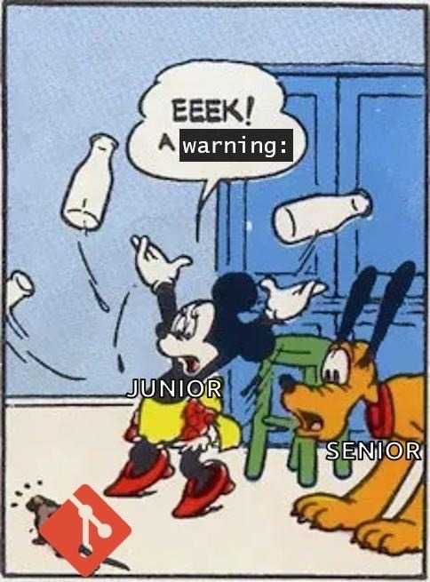
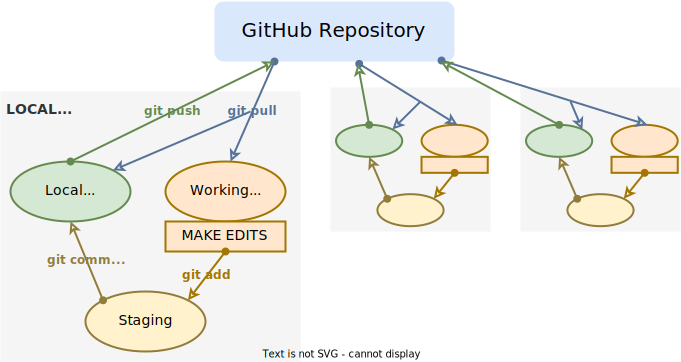

```{r setup, include=FALSE, warning=FALSE, message = FALSE}
full <- TRUE
knitr::opts_chunk$set(echo = FALSE)

library(tidyverse)
library(knitr)
library(kableExtra)
library(fontawesome)

path <- ""
```

**Remember:** Git is more scared of you than you are of git 




```{r child="rmd/commands.Rmd"}
```

```{r child="rmd/processes.Rmd"}
```

# Flow Charts 

